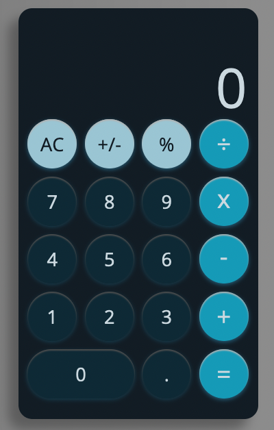
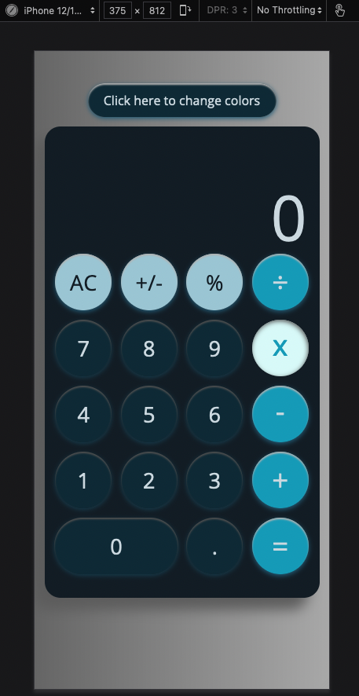
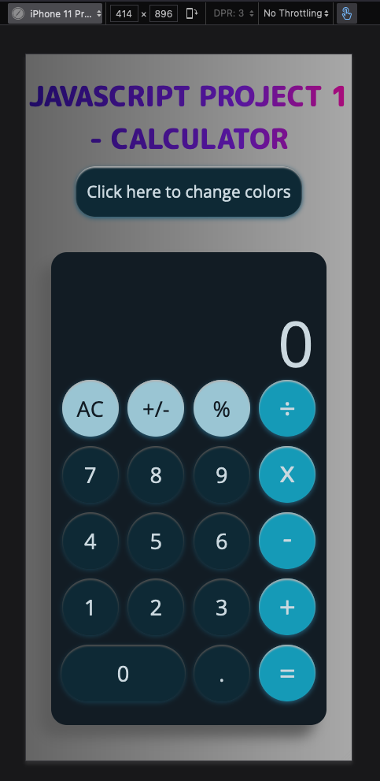
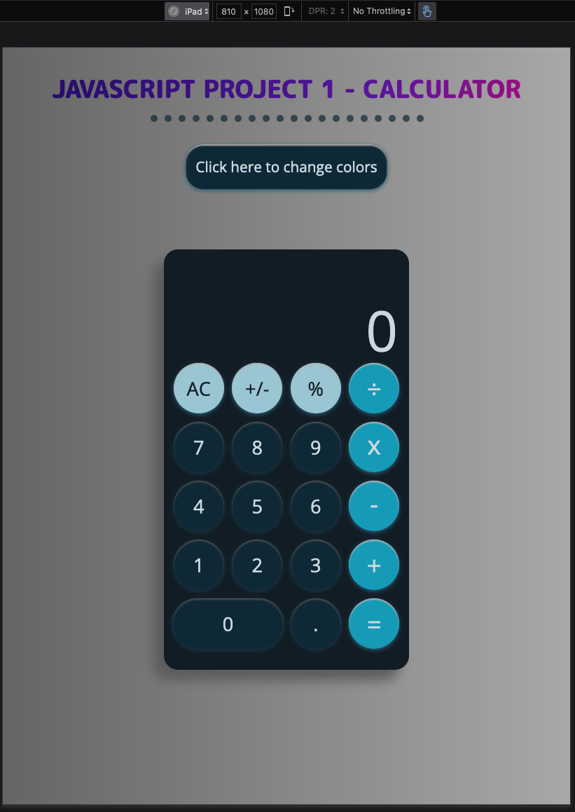
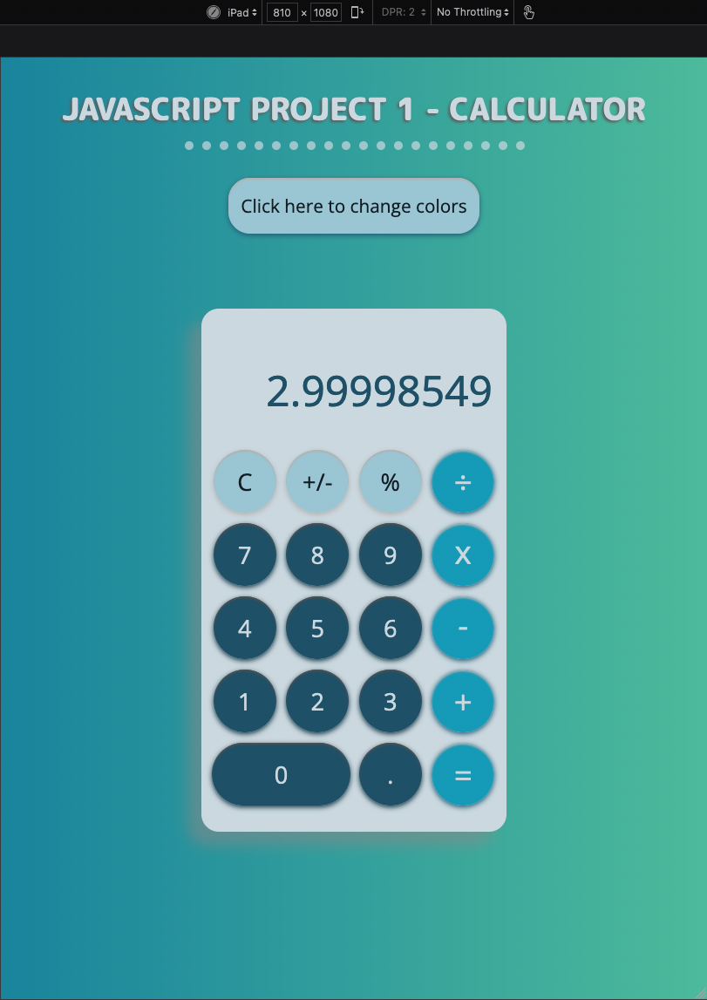

<p align="center">

</p>

<h1 align="center">Calculator</h1>


---

<p align="center"> Simple calculator, which has most of the functions used in the simple version of iPhone's calculator. Works with mouse clicking and with the keyboard.
    <br> 
</p>

## 📝 Table of Contents
- [About](#about)
- [Getting Started](#getting_started)
- [Usage](#usage)
- [Examples](#examples)
- [Screenshots](#screenshots)
- [Built Using](#built_using)
- [Author](#author)

## 🧐 About <a name = "about"></a>
This basic calculator can perform some standard operations like addition, subtraction, multiplication, division, negating numbers (even after pressing the equals button). Works on negative numbers as well as decimals. It has two themes (dark and light), so everyone can choose which one they prefer, with desktop and bigger mobile devices version getting additional colorful heading, and small mobile version just having the calculator itself and theme change button.

## 🏁 Getting Started <a name = "getting_started"></a>
Nothing is needed to run the code, it's fully web based, all you need is just go to the webpage and then it's ready to go - by clicking the buttons on the calculator or using the numbers and operators on the keyboard.

## 🎈 Usage <a name="usage"></a>
- To use calculator either press on buttons with your mouse or use the keyboard - for numbers press digits 0-9, operations work with buttons +-*/, for equals press =, for percentage press %, for negate press ±, for decimal press ., to clear press c, to change theme press t. 
- <b>Inputs and outputs</b> are restricted to 8 decimal places, but not restricted when it comes to the total output.
- To perform any <b>operation</b>, just give at least one number, then press any operator and either give the second number, or press the equal button, which will result in using the first number as a second number as well.
- If second operator is clicked after first one (as when pressed + by mistake and then deciding to press - instead) it will work as expected and change the operator to the new one.
- <b>Percentage</b> button works depending on the operation you are performing, if it's just the first number or a sum (after equals), it's only giving the number as a percentage, the same after choosing the multiply/divide, some number and then percentage button, but after addition/subtraction, it's giving the chosen percentage of the previous number, so it can just be subtracted/added to the value (just as the iPhone's calculator). See below for examples.
- <b>Clear</b> button works both ways, if clicked when "C" on it, then it just clears the current value and the current operator, but the one which was in the memory stays ready for you to choose new operator and new number. To clear everything - press again when "AC" is shown.
- <b>Equals</b> button works in 3 ways - it can be used after giving the second value after the operator, it can use the sum as the second number, when pressed after the operator, and it can add stored value to the sum when just pressing the equals button. See below for examples.
- Operation will be performed also by pressing the next operator symbol - works as equals.
- <b>Negate</b> button can negate current numbers, even with getting the minus before giving the number. But it also can negate the sum after equals is pressed, and make it a current value, ready to use.
- <b>If divided by zero</b>, there is an "infinite" word shown and clear button needs to be pressed twice.
- <b>Decimal</b> works when pressed with current number or when used after the operator, but not when pressed after equals - use 0 or any other number and then decimal instead, then you can perform previous operation, see below for example.
- <b>Theme</b> can be change just by pressing the button above the calculator.
- <b>Icon</b> is animated on Firefox.
- Buttons change color on hover and when they are pressed.


## 🧮 Examples <a name = "examples"></a>
```
20 + 30 = 50
20 + = 40
20 + 30 = = 80
20 + 30 + = 100

80 - = 0
80 - 20 = = 40  // first showing 60, then 40 after second equals
20 x = 400

150 x 30% = 45  // 30% is immediately changed to 0.3
150 + 30% = 195  // 30% is immediately changed to 45

30 + negate button 6 = 24
30 + 20 = 50 negate button -50 <- set to current value
5 + 5 + 5 - 3 = 12  // results immediately changes e.g. (5+5+ gives 10 on the display)

30 + 20 + x 3 = 150  // the addition got canceled by multiplication

10 + 15 = 25 . 0 . 30 = 25.30  // operator was saved, so it has added decimal

90 + 30 "C" - 20 = 70
```

## 📸 Screenshots <a name = "screenshots"></a>






## ⛏️ Built Using <a name = "built_using"></a>
HTML, CSS, SCSS, BEM, DOM, JavaScript

## ✍️ Author <a name = "authors"></a>
- [@DorBia](https://github.com/DorBia)

